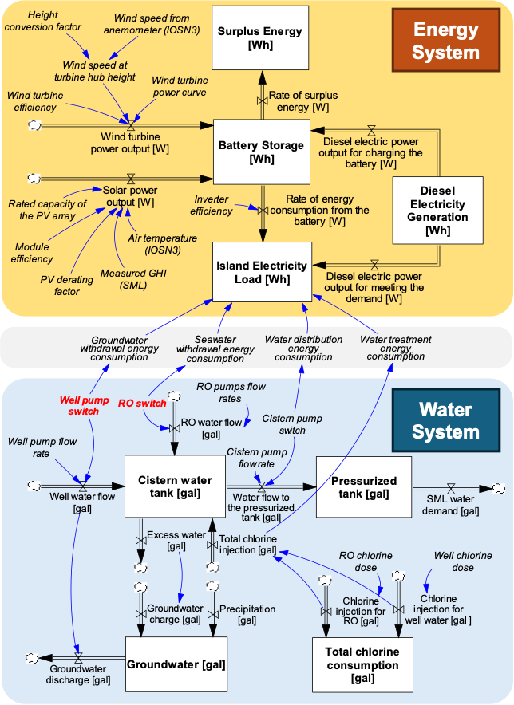

# Shoals Marine Lab Water Energy Dynamic System Model

## Introduction
The below figure represents a simplified schema of the model, which contains two main components: an energy sub-model and a water sub-model. The energy sub-model simulates wind, solar, and diesel energy supply, alongside energy demand and balance. Particularly, wind energy output is calculated based on prevailing wind speeds at each time step, while solar energy is estimated using instantaneous solar radiation and ambient temperature, following equations from Ren et al. (2020) and Lilienthal (2005). Diesel serves as a backup power source, with its operation governed by predefined rules that consider battery storage levels, energy demand, and renewable energy availability. Any excess renewable energy is not utilized. Further details on the energy sub-model's operation can be found in Ghasemi et al (2023). 

The water sub-model simulates the processes and energy use associated with groundwater and seawater intake, treatment, and distribution. The energy uses for these unit processes are determined by the activation of their respective pumps and corresponding flow rates. When a pump is operating, its energy consumption is calculated as the product of its activation and power rating per minute. To enhance the utilization of surplus renewable energy and conserve groundwater for system resilience, a groundwater recharge mechanism was added to the model. When both the cistern and pressurized tanks reach their maximum operational capacities and surplus renewable energy is available, the excess renewable energy is used to desalinate water, which is then diverted to recharge the groundwater well. To model changes in the groundwater well level, a “bathtub” model was developed as a simplified representation of the island’s watershed. This model conceptualizes the watershed as a rectangular storage tank. The tank is replenished by precipitation and groundwater recharge and depleted through groundwater withdrawal.

    

